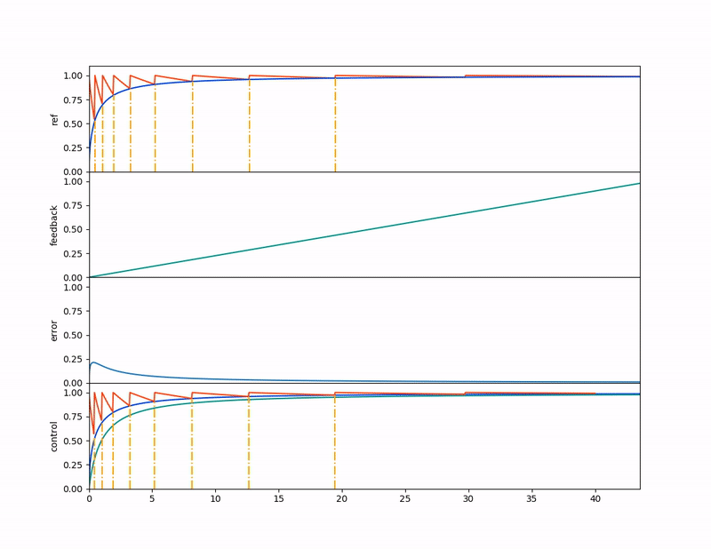

# spaced

A control system for spaced memory repetition

# setup

    python3 -m venv venv
    . /venv/bin/activate
    pip install --editable .
    pip install --upgrade pip

# run tests

    space test

# example

