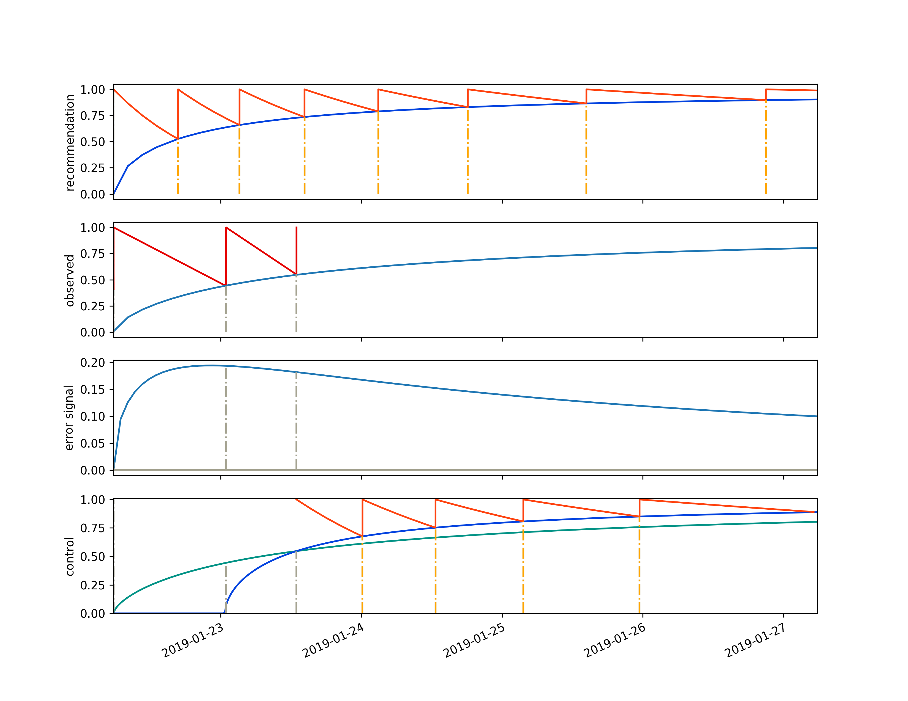

  *Any fool can know.  The point is to understand.*

  -- Albert Einstein

.. _quick-start:

Quick Start
===========

.. _quickstart-getting-an-initial-schedule:

Getting an Initial Schedule
---------------------------

To build a schedule, import a learning tracker and provide it with its initial
conditions:

.. code-block:: python

  from datetime import datetime
  from space.repitition import pp
  from space.repitition import LearningTracker

  days_to_track = 43  # used for graphing

  lt = LearningTracker(
    epoch=datetime.new(),
    range=days_to_track
  )

Then ask your learning tracker for its schedule:

.. code-block:: python

  print("Scheduled as dates")
  pp(lt.schedule())

Something like this would appear in your terminal window:

.. code-block:: text 

	Scheduled as dates
	[ datetime.datetime(2018, 12, 22, 4, 23, 42, 247300),
		datetime.datetime(2018, 12, 22, 15, 28, 53, 456841),
		datetime.datetime(2018, 12, 23, 4, 3, 40, 733013),
		datetime.datetime(2018, 12, 23, 19, 20, 14, 562054),
		datetime.datetime(2018, 12, 24, 15, 33, 37, 943760),
		datetime.datetime(2018, 12, 25, 22, 9, 53, 666487),
		datetime.datetime(2018, 12, 28, 9, 45, 48, 339845),
		datetime.datetime(2019, 1, 6, 9, 51, 41, 920278)]

.. _quickstart-understanding-where-a-schedule-comes-from:

Understanding where a Schedule Comes from
-----------------------------------------

To see the graph from which this schedule was derived:

.. code-block:: python

  hdl, _ = lt.reference.plot_graph()

.. image:: _static/quickstart_reference.svg
    :target: _static/quickstart_reference.pdf
    :align: center

The graph's x-axis represents time while the y-axis represents the amount a
student can remember about the thing they are trying to learn. The student has
perfectly remembered an idea if its score is one and they have utterly forgotten
an idea if its score is zero.

The red stickleback looking graph represents how a students recollection ability
will rise and fall as a function of training events and the passage of time from
a given training event. At first, a student forgets something quickly, but as
they train on an idea, that idea will fade slower from their memory. The sudden
vertical-rise of this red line represents a moment when the student studies.
There is an assumption that they will review an idea long enough that their
immediate recollection of that idea will be perfect before they stop thinking
about it.

The blue line maps to plasticity, or how fast an idea can be mapped into a mind
as a function over time.  It can be thought of as representing how memories form
over the long term.

The training events occur where the forgetting curves of the stickleback
approach the plasticity line. At each intersection of the forgetting curve and
the plasticity curve, orange lines are projected downward to the x-axis to
provide the suggested times of study. Collectively, these times are called the
schedule.

.. _quickstart-adding-student-feedback:

Adding Student Feedback
-----------------------

To begin with the schedule is completely arbitrary.  This is because the model
doesn't understand anything about the student yet.  But each time you give it
student data it adapts its schedule to the student's behavior, and how they
appear to be forgetting things.

Imagine that immediately after looking at the material for the first time; our
student tries to remember what they just learned.  They determine that they can
recall about 40 percent of the material.  To tell ``spaced`` about this, we
would write the following code:

.. code-block:: python

  days_since_training_epoch = 0
  lt.learned(result=0.4, when=days_since_training_epoch)

Immediately after finishing their test, the student reviews the material until
they understand all of it.

Suppose that 19 hours later (0.8 days later), the student tests themselves
again.  This time they can remember 44 percent of it.  Let's feed this into the
learning tracker, by writing the following code:

.. code-block:: python

  days_since_training_epoch = 0.8
  lt.learned(result=0.44, when=days_since_training_epoch)

As before, the student reviews the material after they have tested themselves.

.. _quickstart-getting-a-schedule-which-responds-to-the-student's-feedback:

Getting a Schedule which Responds to the Student's Feedback
-----------------------------------------------------------

Now that ``spaced`` has more data, let's ask it for its new schedule:

.. code-block:: python

  print("Scheduled as dates")
  pp(lt.schedule())

In your terminal you will see something like this:

.. code-block:: text

	Scheduled as dates
	[ datetime.datetime(2018, 12, 23, 1, 53, 3, 865177),
		datetime.datetime(2018, 12, 23, 16, 32, 43, 271301),
		datetime.datetime(2018, 12, 24, 11, 49, 1, 151759),
		datetime.datetime(2018, 12, 25, 17, 9, 28, 362910),
		datetime.datetime(2018, 12, 28, 3, 57, 43, 777324),
		datetime.datetime(2019, 1, 7, 0, 21, 16, 69957),
		datetime.datetime(2018, 12, 21, 14, 0, 13, 200220),
		datetime.datetime(2018, 12, 22, 1, 26, 21, 259959),
		datetime.datetime(2018, 12, 22, 13, 46, 42, 422666),
		datetime.datetime(2018, 12, 23, 4, 26, 21, 828789),
		datetime.datetime(2018, 12, 23, 23, 42, 39, 709248),
		datetime.datetime(2018, 12, 25, 5, 3, 6, 920399),
		datetime.datetime(2018, 12, 27, 15, 51, 22, 334813),
		datetime.datetime(2019, 1, 6, 12, 14, 54, 627446)]

.. _quickstart-understanding-the-reactive-schedule:

Understanding the Reactive Schedule
-----------------------------------

The ``spaced`` schedule changes as it reacts to feedback from the student. To
see why this change has occurred we can look at the plots from which this
schedule is derived:

.. code-block:: python

  hdl, _ = lt.plot_graphs()

The learning tracker diagram above contains four different graphs.  The first
graph is called the recommendation.  It represents the goal of our training
engagement with this student for the thing that they are trying to learn.  It is
exactly the same as the reference graph we plotted above.  

The 2nd graph represents the observed data that the student has given us.  At
time zero they could remember 40 percent of an idea after their initial
training session.  They retrained, then retested themselves 0.8 days later and
got 44 percent. Then they retrained again.  The light blue line on the observed
curve is an analogue to the dark blue line on the recommendation curve.  It is
a plasticity curve, but unlike the reference-plasticity curve in the
recommendation graph, the observed-plasticity curve is discovered by fitting a
line to the data provided as feedback from the student.  It is describing how a
long term memory is actually forming in the student's mind, not how we wish it
would be formed (represented by the dark blue line in the recommendation graph).

The 3rd graph down the page, labeled "error signal" is the difference between
what we want and what we got.  Specifically it is the difference between the
recommendation graphs plasticity curve and the observed plasticity curve (the
dark blue line in the first graph minus the light blue graph in the second graph).
The y-axis of this plot can be positive, if a memory isn't forming as fast as we
want, or negative, if the student is studying too much or doesn't really forget
things; causing a memory to form faster than our recommendation.

The final graph, the 4th graph, is labeled "control".  This is because it
describes how the ``spaced`` algorithm tries to drive its error signal to zero
by controlling the world in the only way it can: by shifting its schedule
recommendations.  It does this in two ways, it tunes the forgetting curves (the
red stickleback lines) to match how a student actually forgets things and it
finds the intersection between the observed plasticity curve and the
reference-plasticity curve, then redraws the updated-forgetting-stickleback on
the reference-plasticity curve at this intersection point.

Lets see what happens if the student continues to train.

.. code-block:: python

  # students tests themselves 1.75 days after they start training
  # they recall about 64 percent of the thing they are studying
  days_since_training_epoch = 1.75
  lt.learned(result=0.64, when=days_since_training_epoch)
  # the student reviews their material until 
  # they have a perfect recollection

  # students tests themselves 3.02 days after they start training
  # they recall about 76 percent of the thing they are studying
  days_since_training_epoch = 3.02
  lt.learned(result=0.76, when=days_since_training_epoch)
  # the student reviews their material until 
  # they have a perfect recollection

.. image:: _static/quickstart_control_after_four_events.png
    :target: _static/quickstart_control_after_four_events.pdf
    :align: center

Now suppose the student trains six more times:

.. code-block:: python

  days_and_results = [ 
    [4.8,  7.33, 10.93, 16.00, 23.00, 29.00],
    [0.83, 0.89,  1.00,  0.99, 0.99,   1.00],
  ]

  for d, r in zip(*days_and_results):
    days_since_training_epoch, result = d, r
    lt.learned(result=result, when=days_since_training_epoch)

  print(lt.schedule())

.. code-block:: python

  [datetime.datetime(2019, 1, 18, 21, 24, 51, 192016)]

Let's take a look at the graph:

.. code-block:: python

  hdl, _ = lt.plot_graphs()

This last graph really isn't that useful: the next recommended training date
isn't on its control plot.  

In fact, it's hard to get a clear idea about what is going on by looking at any
of these plots, since you really have to see the graph from the previous
feedback event, to understand the current context.  What would be nice would be
an animation of each training event followed by the next.  You could watch it
for 10 seconds and get a good idea about their training history.

.. _quickstart-animating-reactive-schedule-to-get-an-intuitive-feel:

Animating the Reactive Schedule to get an Intuitive Feeling about Results
-------------------------------------------------------------------------

The ``spaced`` package can write ``mp4`` encoded videos using the ``ffmpeg``
animation plugin provided by matplotlib.

To make a video, using the ``animate`` api:

.. code-block:: python

  lt.animate(
    student="Name of Student",
    name_of_mp4="results/report_card.mp4",
    time_per_event_in_seconds=2.2)

If you were to write this code, the results of this session would be used to
make a video in ``results/report_card.mp4``.  That video would look something like this:

.. raw:: html

  

  <iframe width="560" height="315" src="https://www.youtube.com/embed/H8llYuwH5L0" frameborder="0" allow="accelerometer; autoplay; encrypted-media; gyroscope; picture-in-picture" allowfullscreen></iframe>
  

As you play the video, you see a story unfold about the relationship between our
model and the student's reaction to it. In the first five days of their
training, we see that they made more mistakes than we would have liked, then,
around the seventh day, something clicks for them, and they do better than what
was predicted by the original model.

We can see that the control system tried to get them to do much more training
when they were doing poorly, and less training when they started to understand
the material. When the dark blue reference curve in the control box moved to the
left, the student was doing better than expected, and when it shifted to the
right, the student was doing worse than expected.

We also see that our initial forgetting curves were too pessimistic, and as a
result our initial schedule was too aggressive. But after a few training events,
the spaced algorithm began to match the forgetting parameters to how the student
actually forgot things.

The video plays a training event every second, which means that we are
accelerating time since the training events become more and more spaced out the
later they occur.

.. _quickstart-predicting-future-results:

Predicting Future Results
-------------------------

But, it is unlikely that you will be using ``spaced`` to track just one object.  You
will probably have thousands of them running, and you will have to select from a
small subset of these thousands of tracked objects to compile a review session for your
student.  To do this, you need to know which of your tracked ``spaced`` objects
are in the most need of attention.

For this reason you will need to query a ``spaced`` object so that it can make a
prediction about a student's ability to recall a fact at some datetime.  To predict
a result, you can use the learning tracker's ``predict_result`` api.

To demonstrate this, I will make a set of predictions and graph them onto the
plot generated by the learning tracker.

Here is how to do this:

.. code-block:: python

  from datetime import datetime
  from repetition import pp
  from repetition import LearningTracker

  # create a learning tracker
  lt = LearningTracker(
      epoch=datetime.now(),
  )

  # give our learning tracker some feedback
  for d, r in zip( 
      [0,    0.8,  1.75, 3.02, 4.8,  7.33],
      [0.40, 0.44, 0.64, 0.76, 0.83, 0.89],
    ):
    # r: result
    # d: days since training epoch
    lt.learned(result=r, when=d)

  # get a set of datetimes
  useful_range_of_datetimes = \
    lt.range_for(curve=1, range=10, day_step_size=0.5)

  # make a results query using these datetimes
  results = [lt.predict_result(moment, curve=1) for
              moment in useful_range_of_datetimes]
  hdl, _ = lt.plot_graphs()

  # get the handle for the last subplot so we can draw on it
  control_plot = hdl.axarr[-1]
  control_plot.plot(
    useful_range_of_datetimes, results, color='xkcd:azure')

Here is the resulting plot:

.. image:: _static/quickstart_control_after_five_events_and_query.svg
     :target: _static/quickstart_control_after_five_events_and_query.pdf
     :align: center

You can see when we plot a set of queries for the results of the first learning
curve over a set of datetimes, that the line representing this information
extends downward past the plasticity line.  This is because the query assumes
that no additional training event will occur.

.. _quickstart-building-a-better-initial-student-model:

Building a Better Initial Student Model
---------------------------------------
As the ``spaced`` algorithm reacts to student feedback, it gets a much better
idea about how the student remembers and forgets in their current environment.
It's control system tunes the forgetting and plasticity parameters as it tries
to build a better schedule.

Now imagine we let one learning tracker run for a while, then we pulled it's
discovered parameters to create some initial conditions for another learning
tracker, one with a more realistic set of goals.  These goals would be based on
how a student has behaved in the past, instead of some imagined thing.

I'll demonstrate how to do this, by first simulating a full training session (10
lessons) using the arbitrary default values of the ``spaced`` algorithm.

.. code-block:: python

  from datetime import datetime
  from repetition import LearningTracker

  day_offset_from_epoch_and_results = [ 
      [0,    0.81, 1.75, 3.02, 4.8,  8.33, 10.93, 16.00, 23.00, 29.00],
      [0.40, 0.44, 0.64, 0.84, 0.83, 0.89,  1.00,  0.99, 0.99,   1.00],
  ]

  # create a learning tracker with arbitrary default parameters
  lt_arbitrary = LearningTracker(
    epoch=datetime.now(),
  )

  # plot the third lesson so we can take a look at the differences 
  # between some made up model and a model based
  # on some previous feedback
  lesson_to_graph = 3

  # mimic a full training session
  for index, (d, r) in \
    enumerate(zip(*day_offset_from_epoch_and_results)):
    # r: result
    # d: days since training epoch
    lt_arbitrary.learned(result=r, when=d)

    # plot the lesson we want to graph
    if index is lesson_to_graph - 1:
      hdl, _ = lt_arbitrary.plot_graphs()

.. image:: _static/quickstart_arbitrary.svg
    :target: _static/quickstart_arbitrary.pdf
    :align: center

So what can we learn from this?

  1.  Our student forgets things slower than we expected:  The forgetting curves
  in the recommendation plot are steeper than that seen in the feedback
  plot.

  2.  Our student is remembering the things slower than we wanted them to learn:  The error
  signal is positive.

Now lets build another learning tracker using the discovered parameters from
letting the first learning tracker run for ten lessons:

.. code-block:: python

  # get better initial model parameters based on previous
  # experience with the student
    
  # to get the discovered parameter from a previous training session,
  # pre-pend 'discovered' in front of the parameter name,
  # and call this word like a function
  bpr = lt_arbitrary.discovered_plasticity_root()
  bpdo = lt_arbitrary.discovered_plasticity_denominator_offset()
  bf0 = lt_arbitrary.discovered_fdecay0()
  bft = lt_arbitrary.discovered_fdecaytau()

  lt_better_fit = LearningTracker(
    epoch=datetime.now(),
    plasticity_root=bpr,
    plasticity_denominator_offset=bpdo,
    fdecay0=bf0,
    fdecaytau=bft
  )

  # plot the third lesson so we can take a look at the differences 
  # between some made up model and a model based
  # on some previous feedback
  lesson_to_graph = 3

  for index, (d, r) in \
    enumerate(zip(*day_offset_from_epoch_and_results)):
    # r: result
    # d: days since training epoch
    lt_better_fit.learned(result=r, when=d)

    # plot the lesson we want to graph
    if index is lesson_to_graph - 1:
      lt_better_fit.plot_graphs()

.. image:: _static/quickstart_better_fit.svg
    :target: _static/quickstart_better_fit.pdf
    :align: center

Let's try and pretend this plot is from real student feedback and not from a
conjured example.

We trust our recommendation curve more than we did when it was completely
arbitrary, what can we learn from this diagram?

Our eyes glance at how the forgetting curves on the recommendation graph and the
observed plot are falling at around the same rate.  This let's us make a better
inference about the control plot, we can see that our goals are more realistic
so the difference between what we want and what we got can be attributed to how
the student isn't meticulously following our recommended schedule.  This is of
little consequence, since the schedule is adaptive:  Our student seems on track.

.. raw:: html

  <a class="reference internal" href="introduction.html"prev</a>, <a class="reference internal" href="index.html#top">top</a>, <a class="reference internal" href="recipes.html">next</a>

.. toctree::
   :maxdepth: 2
   :caption: Contents:

